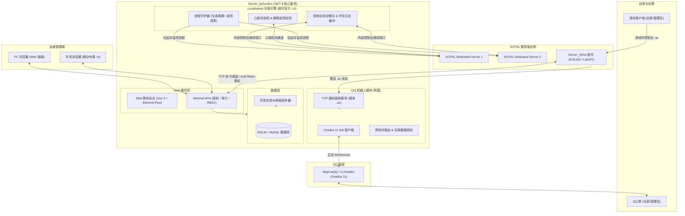

# Server_Qcha (Qridge)

### SCP: Secret Laboratory 现代化 Web 运维控制面板与集群管理系统

---

## 项目简介

**Server_Qcha (Qridge)** 是专为 **SCP: Secret Laboratory (SCPSL)** 打造的现代化 Web 运维控制面板与集群管理系统。

系统从协议底层**深度取代官方 LocalAdmin (LA) 命令行黑框**，内置心跳守护与崩溃自愈状态机，提供 PC 端与手机端专属的自适应管理控制台；同时集成 QQ 机器人联动作为附属功能，实现游戏内报警求助与玩家社群互动。

---

## 核心特性概览

- **全面取代官方 LocalAdmin**：通过 `-console`、`-id`、`-heartbeat` 内部通道原生接管游戏进程，支持心跳状态机、静默崩溃检测与防死循环重启限流；
- **现代化 Web 运维控制台**：纯原生 ES Modules 架构（Vue 3 + Element Plus），零编译构建依赖，开箱即用；
- **手机专属自适应 UI 界面**：屏幕宽度 $\le 768\text{px}$ 自动激活移动端专属界面，配备侧滑抽屉导航与 94vw 触控自适应弹窗；
- **24 小时在线走势与运营看板**：全服在线/今日峰值实时监控，后台定时采样并精准过滤 `Dedicated Server` 虚报；
- **细粒度 RBAC 权限系统**：支持多管理员协同与多设备并发登录，密码修改全端互斥踢下线；
- **全方位操作审计日志**：完整记录所有控制台指令与管理动作的操作人、时间、来源 IP 与执行结果；
- **双生态游戏服务端插件**：同时支持 EXILED 8+ 与 LabAPI 1.1+，双向通信全程附带 AuthToken 鉴权；
- **游戏内快捷求助与 QQ 机器人联动**：玩家在游戏控制台输入 `.ac <内容>` 瞬间推送到 QQ 管理群，在线管理员屏幕同步广播。

---

## 官方 LocalAdmin 与 Qridge 对比

| 运维能力 | 官方 LocalAdmin (LA) | Qridge Web 管理面板 |
|---|---|---|
| **交互媒介** | 本地命令行窗口 (CLI) | 现代 Web 控制台（PC 端 + 手机专属 UI） |
| **多服管理** | 一服一窗口，杂乱分散 | 单一控制台集中管理全服集群 |
| **远程管控** | 必须依赖 RDP / SSH | 任意设备浏览器即可访问，随时随地运维 |
| **自愈守护** | 基础崩溃退出重启 | 完备心跳状态机、静默卡死检测、重启频次限流保护 |
| **控制台交互** | 简单黑框打印 | Web 交互控制台、环形日志缓冲区、ANSI 颜色高亮与热过滤 |
| **权限管控** | 无，全员超级管理员 | 细粒度 RBAC 权限系统，可精确授权各模块操作 |
| **运营分析** | 无 | 24 小时在线玩家动态趋势折线图、全服在线与今日峰值 |
| **操作审计** | 无 | 全局审计日志，每次操作记录时间、人员、IP 与结果 |
| **社区联动** | 无 | 内置附属 QQ 机器人，打通游戏内与群内双向交互 |

---

## 文档导航中心

为了便于查阅，项目详细文档已按功能模块独立归档：

| 文档名称 | 内容简述 | 链接 |
|---|---|---|
| **快速上手与全平台部署** | 运行环境要求、分步安装流程、单机与多机集群部署指南 | [docs/getting-started.md](docs/getting-started.md) |
| **Web 面板与 LocalAdmin 替代说明** | 守护原理、心跳状态机、8 大功能模块详解与手机端 UI 指南 | [docs/web-panel.md](docs/web-panel.md) |
| **游戏服务端插件指南** | EXILED 与 LabAPI 插件安装、双向通信、AuthToken 鉴权与 .ac 指令 | [docs/plugin-guide.md](docs/plugin-guide.md) |
| **QQ 机器人与群服联动指南** | OneBot 11 协议对接、NapCatQQ 配置、群指令大全与玩家数据绑定 | [docs/bot-guide.md](docs/bot-guide.md) |
| **配置文件参考手册** | `appsettings.json` 与插件 `config.yml` 完整字段速查手册 | [docs/configuration.md](docs/configuration.md) |
| **常见问题与排错手册 (FAQ)** | 无法访问、Token 错误、端口开放、崩溃重启排查等常见问题解答 | [docs/faq.md](docs/faq.md) |

---

## 系统架构

---

## 3 步极速上手

1. **下载程序**：从 [Releases 页面](https://github.com/jikekei/Server_Qchat/releases) 下载 `Server_Qcha.Bot-vX.X.X.zip` 并解压；
2. **生成配置**：复制 `appsettings.Example.json` 为 `appsettings.Local.json`，按需配置端口与服务器可执行文件路径；
3. **启动运行**：运行 `Server_Qcha.Bot.exe`，浏览器打开 `http://127.0.0.1:8080/`，使用控制台打印的初始密码登录即可。

详细部署说明与多机集群配置请参阅 [快速上手指南 (docs/getting-started.md)](docs/getting-started.md)。

---

## 开源协议

本项目基于 [MIT License](LICENSE) 协议开源。
