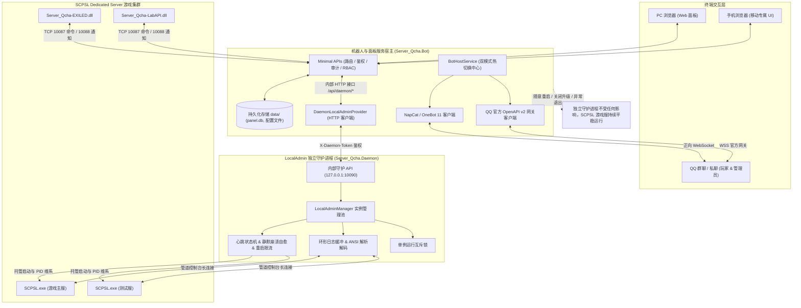

# Server_Qcha (Qridge)

### SCP: Secret Laboratory 现代化 Web 运维控制面板、独立守护集群与社群机器人系统

[在线文档中心](docs/getting-started.md) · [下载最新发布包 (Releases)](https://github.com/jikekei/Server_Qchat/releases) · [提交 Issue 报障](https://github.com/jikekei/Server_Qchat/issues)

---

## 核心特性概览

- **LocalAdmin 独立守护架构 (Server_Qcha.Daemon)**：
  - 将游戏服生命周期维系与面板/机器人彻底解耦。
  - 更新面板、重启机器人甚至 Bot 意外崩溃，游戏服（SCPSL.exe）绝不关闭，在线玩家零感知、零掉线。
  - 支持免脚本启动，启动 Bot 时全自动静默检测并在后台拉起守护进程。
- **Web 实时守护监控与生命周期管理**：
  - 在 Web 面板直观监控守护进程的运行状态、PID、物理内存占用（工作集 MB）、专用内存、存活时长、线程数与托管服务器运行负载。
  - 支持在 Web 端一键启动、带二次确认的停机与平滑重启、手动刷新状态。
- **QQ 机器人双模式引擎（NapCat + 腾讯官方 Bot OpenAPI v2）**：
  - **NapCat (OneBot 11)**：传统正向 WebSocket 协议，群聊私聊全量支持。
  - **QQ 官方机器人开放平台**：基于 WebSocket 网关、Token 自动刷新、消息保活与频控配额管理。
  - **在线平滑热切换**：在 Web 控制台中一键切换机器人接入引擎，无需重启服务。
  - **官方指令面板 (/v2/panels)**：支持一键同步指令至腾讯官方客户端菜单，支持管理员权限标记。
- **现代化 Web 运维控制台 (Qridge)**：
  - 基于 Vue 3 + Element Plus 的纯原生 ES Modules 架构，零构建打包编译依赖，开箱即用。
  - 提供实时交互控制台、环形内存日志缓冲（ANSI 彩色高亮解码与日志级别过滤）。
- **移动端专属自适应 UI 界面**：
  - 视口宽度 <= 768px 自动激活移动专属布局，提供侧滑抽屉导航与 94vw 触控优化弹窗。
- **24 小时在线走势与运营看板**：
  - 全服在线总数与今日峰值 KPI 统计，后台周期采样精准剔除 Dedicated Server 虚假占位。
- **细粒度 RBAC 权限体系与全量审计**：
  - 支持多管理员并发登录，PBKDF2-SHA256 强哈希存储，操作审计精确记录人员、时间、来源 IP 与执行结果。
- **双生态游戏服务端插件**：
  - 官方支持 EXILED 8+ 与 LabAPI 1.1+ 平台，双向 TCP 通信全程 AuthToken 密码学鉴权，支持游戏内 `.ac <内容>` 一键报警呼叫群管理。

---

## 官方 LocalAdmin 与 Qridge 对比

| 运维能力 | 官方 LocalAdmin (LA) | Qridge 现代化运维系统 (v2.0) |
|---|---|---|
| **交互媒介** | 本地黑框命令行 (CLI) | 现代 Web 控制台（PC 端 + 手机专属 UI） |
| **进程解耦** | 关掉窗口游戏服必掉线 | **独立守护架构**：更新或关闭面板，游戏服绝对不关、玩家不掉线 |
| **集群多服管控** | 一服一窗口，多开杂乱易混 | 单一控制台集中监控管理所有游戏服与守护进程 |
| **远程运维** | 必须依赖 Windows RDP / SSH | 任意设备浏览器即可安全访问，随时随地手机运维 |
| **守护与自愈** | 基础退出重启 | 完备心跳状态机、静默卡死检测、重启频次限流保护 |
| **性能监控** | 无指标统计 | 实时监控物理内存占用 (MB)、专用内存、PID 与存活时长 |
| **控制台交互** | 简单黑框打印 | Web 交互控制台、环形日志缓冲区、ANSI 颜色高亮与日志级别热过滤 |
| **权限体系** | 无，接触者均为最高管理员 | 细粒度多账号 RBAC 权限系统，可精确授权各模块操作 |
| **运营分析** | 无 | 24 小时动态折线图、全服今日最高在线峰值分析 |
| **社群联动** | 无 | 深度集成 NapCat / QQ 官方机器人，打通群服双向指令与游戏内报警呼叫 |

---

## 系统架构

---

## 官方文档导航

项目包含完整且经过实机验证的专题文档：

| 文档名称 | 内容概览 | 快速链接 |
|---|---|---|
| **快速上手与全平台部署** | 基础要求、开箱运行、单机与多机集群部署指南 | [docs/getting-started.md](docs/getting-started.md) |
| **Web 面板与 LocalAdmin 替代说明** | 独立守护架构详解、心跳自愈机制、Web 监控管理与移动端适配 | [docs/web-panel.md](docs/web-panel.md) |
| **游戏服务端插件指南** | EXILED 与 LabAPI 插件安装、TCP 双向通信、Token 鉴权与 `.ac` 呼叫 | [docs/plugin-guide.md](docs/plugin-guide.md) |
| **QQ 机器人与群服联动指南** | 官方机器人 (OpenAPI v2) 与 NapCat 快速配置、指令表与指令面板同步 | [docs/bot-guide.md](docs/bot-guide.md) |
| **配置文件参考手册** | `appsettings.json`、守护配置与插件 `config.yml` 完整字段速查 | [docs/configuration.md](docs/configuration.md) |
| **常见问题与排错手册 (FAQ)** | 端口占用、权限冲突、进程闪退排查与自愈诊断方案 | [docs/faq.md](docs/faq.md) |

---

## 3 步极速上手

1. **下载发行包**：前往 [Releases 页面](https://github.com/jikekei/Server_Qchat/releases) 下载最新版本的 `Server_Qcha.Bot-v2.0.0.zip`，并解压至您的部署目录；
2. **确认配置**：复制 `appsettings.Example.json` 为 `appsettings.Local.json`（或直接使用内置配置），按需配置游戏服的 `SCPSL.exe` 路径；
3. **一键启动运行**：
   - **方式 A（推荐）**：双击运行 **`一键启动(守护+机器人).bat`**；
   - **方式 B（免脚本）**：直接双击运行 **`Server_Qcha.Bot.exe`**，程序会自动检测并在后台拉起独立守护进程；
   - 打开浏览器访问 `http://127.0.0.1:8080/`，使用控制台首次输出的初始管理员密码登录即可。

---

## 常见脚本命令速查

解压目录中内置了开箱即用的快捷脚本：

- **`一键启动(守护+机器人).bat`**：按推荐依赖顺序同时启动后台守护进程与机器人面板；
- **`启动守护进程(Daemon).bat`**：仅启动守护进程（用于需要常驻游戏服而无需开启 Web 控制台的服务器场景）；
- **`停止守护进程.bat`**：一键安全停机并终止后台运行的守护进程。

---

## 开源协议与版权声明

本项目基于 [MIT License](LICENSE) 协议开源。

Copyright 2025 hmyhserver.top

欢迎提交 Issue 与 Pull Request 共同完善 SCP: Secret Laboratory 中文生态。
