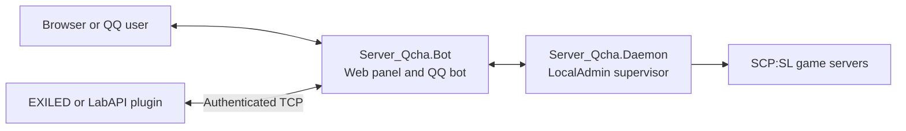

# Server_Qcha (Qridge)

[English](README.md) · [简体中文](README.zh-CN.md)

### A web operations panel, standalone game-server supervisor, and QQ community bot for SCP: Secret Laboratory

[English documentation](docs/getting-started.en.md) · [中文文档](docs/getting-started.md) · [Latest release](https://github.com/jikekei/Server_Qchat/releases/latest) · [Report an issue](https://github.com/jikekei/Server_Qchat/issues)

---

Server_Qcha (Qridge) connects SCP:SL game servers to a browser-based control panel and QQ communities. It includes a .NET 8 bot and web application, an independent LocalAdmin daemon, and server plugins for EXILED and LabAPI.

## Highlights

- **Independent game-server supervision**: `Server_Qcha.Daemon` owns managed game-server processes. Restarting, updating, or closing the bot does not shut down games managed by the daemon.
- **Web operations panel**: Manage servers, inspect daemon health, review console output, and monitor player history and load trends from desktop or mobile browsers.
- **Two QQ bot integrations**: Use NapCat with OneBot 11 or the official QQ Bot OpenAPI v2 integration. The active engine can be switched in the panel.
- **EXILED and LabAPI plugins**: Select the plugin that matches your server installation. Both communicate with the bot over the same authenticated TCP protocol.
- **Account permissions and audit records**: The panel supports multiple accounts, granular RBAC permissions, hashed passwords, and operation auditing.

## Architecture

```mermaid
flowchart LR
    User[Browser or QQ user] <--> Bot[Server_Qcha.Bot<br/>Web panel and QQ bot]
    Bot <--> Daemon[Server_Qcha.Daemon<br/>LocalAdmin supervisor]
    Daemon --> Games[SCP:SL game servers]
    Plugins[EXILED or LabAPI plugin] <-->|Authenticated TCP| Bot
```

The bot and daemon share persistent files under `data/`. Back up `data/` and `appsettings.json` before upgrading, and retain your local configuration when replacing program files.

## Quick start

1. Download `Server_Qcha.Bot-v2.0.1.zip` from the [latest release](https://github.com/jikekei/Server_Qchat/releases/latest) and extract it to your deployment directory.
2. Install the .NET 8 ASP.NET Core Runtime.
3. Copy `appsettings.Example.json` to `appsettings.Local.json`, then configure your QQ connection, managed game servers, and shared authentication tokens.
4. Install either `Server_Qcha-EXILED.dll` or `Server_Qcha-LabAPI.dll` in the matching game-server plugin directory. Do not load both frameworks on the same server instance.
5. Start `一键启动(守护+机器人).bat`, or launch `Server_Qcha.Bot.exe`. Open `http://127.0.0.1:8080/` and use the initial administrator credentials printed in the console.

The web panel listens on loopback by default. To access it from another device, configure `WebPanel:Host` as `0.0.0.0` and restrict access with a firewall. The startup log detects local IPv4 addresses and prints the corresponding panel URLs.

## Security notes

- Replace empty or default shared tokens with random values, and configure matching values in the bot, daemon, and selected game plugin. Current compatibility behavior logs a warning and continues to start when a token is empty or uses the legacy default.
- The TCP protocol authenticates messages with HMAC, timestamps, and replay checks; it does **not** encrypt network traffic. Use a VPN or firewall allowlist for communication between machines.
- Configure explicit QQ administrator and group allowlists. Empty administrator lists preserve legacy permission behavior for compatibility.
- Never commit API keys, passwords, database connection strings, or machine-specific configuration.

## Project documentation

- [English deployment guide](docs/getting-started.en.md)
- [Chinese web panel guide](docs/web-panel.md)
- [Chinese bot configuration and commands](docs/bot-guide.md)
- [Chinese plugin guide](docs/plugin-guide.md)
- [Database and build-reference security notes](docs/database-security.md)
- [Bot component README](bot/README.en.md)
- [EXILED plugin README](server/README.en.md)
- [LabAPI plugin README](server-labapi/README.en.md)

## License

This project is licensed under the [Apache License 2.0](LICENSE). SCP: Secret Laboratory, Unity, EXILED, and LabAPI are separate products and remain subject to their respective owners' terms. Game-server reference assemblies are not distributed in this repository; see [database and build-reference security notes](docs/database-security.md) for build setup.
