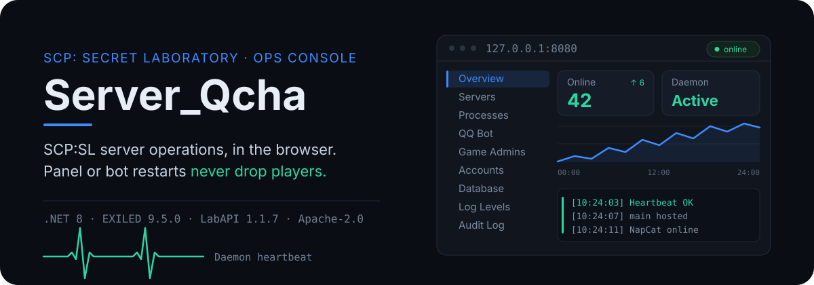
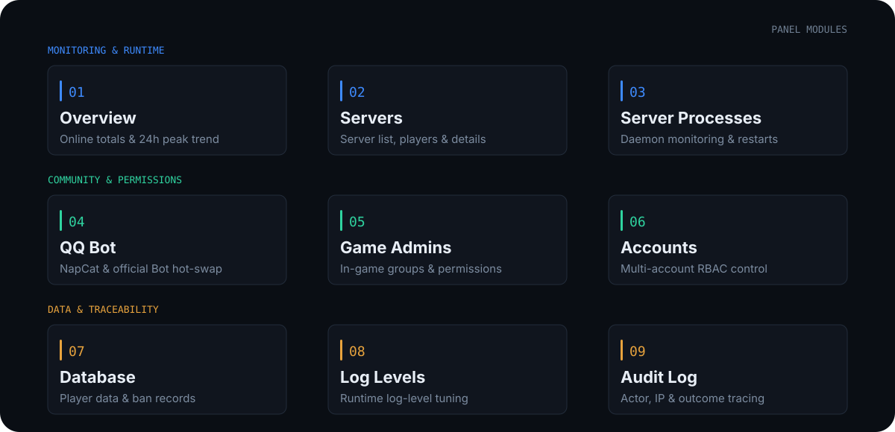
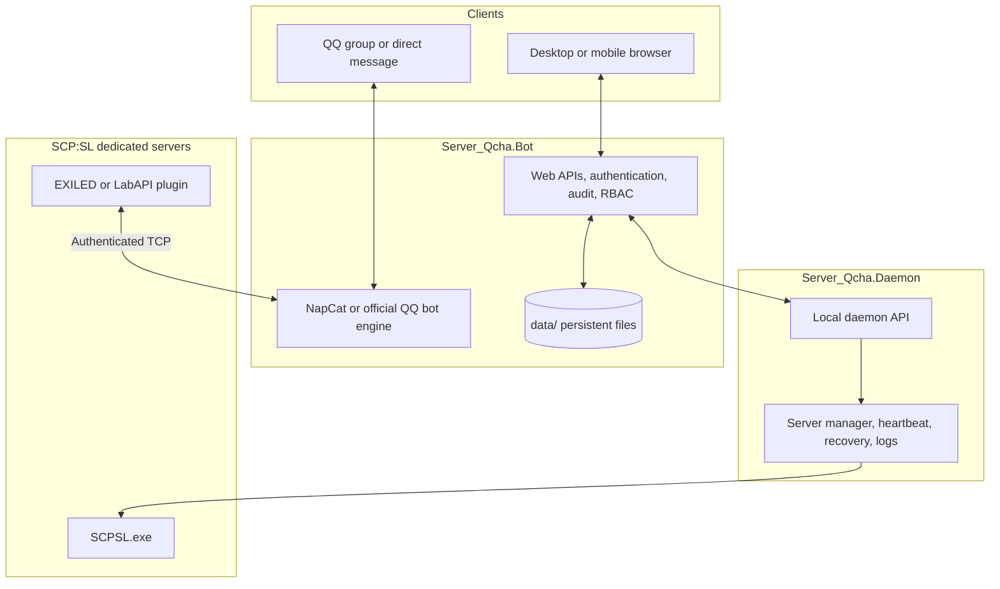

[English](README.md) · [简体中文](docs/zh-CN/README.md)

[English documentation](docs/README.md) · [中文文档](docs/README.zh-CN.md) · [Latest release](https://github.com/jikekei/Server_Qchat/releases/latest) · [Report an issue](https://github.com/jikekei/Server_Qchat/issues)

---

Server_Qcha, also known as Qridge, connects SCP: Secret Laboratory game servers to a browser-based operations panel and QQ communities. The project combines a standalone server supervisor, a dual-engine QQ bot, a mobile-friendly web console, and plugins for EXILED and LabAPI.

## Key features

- **Standalone LocalAdmin supervisor (`Server_Qcha.Daemon`)**: Separates game-server lifecycle management from the panel and bot. Restarting, updating, or crashing the bot does not terminate game servers managed by the daemon. The bot can automatically start the daemon.
- **Live daemon monitoring and control**: View daemon status, PID, working-set and private memory, uptime, thread count, and managed-server load. Start, stop with confirmation, or restart the daemon from the panel.
- **Two QQ bot engines**: Connect through NapCat (OneBot 11) or Tencent's official QQ Bot OpenAPI v2. The panel can switch engines while running and synchronize official command panels through `/v2/panels`.
- **Qridge web console**: Built with Vue 3 and Element Plus using native ES modules, without a front-end build step. It includes an interactive console, an in-memory circular log buffer, ANSI color decoding, and log-level filtering.
- **Responsive mobile interface**: A dedicated layout activates at viewports up to 768 px, with a slide-out navigation drawer and touch-friendly dialogs.
- **Operations dashboard**: Displays 24-hour online-player trends, the daily peak, and periodically sampled statistics that filter the Dedicated Server placeholder.
- **Multi-account RBAC and audit trail**: Supports concurrent administrator sessions, PBKDF2-SHA256 password hashing, and operation records with actor, time, source IP, and result.
- **In-game administrator and permission-group management**: Reads and edits the administrators and permission groups stored in each server's `config_remoteadmin.txt`, so the file no longer needs manual editing. Permissions are granted item by item, permission groups carry a badge text and color, plugin permissions are configured per node with a master switch plus allow/deny rules, and per-user overrides can be added without touching the group. Permission groups can also be copied across servers, and edits are applied live by the plugin — revoking an online administrator takes effect immediately without restarting the game server. Requires the `game-admin.manage` panel permission, which the built-in administrator holds by default.
- **Two game-server plugin options**: EXILED is built against the repository's `ExMod.Exiled` 9.5.0 dependency; LabAPI targets 1.1.7+. Their TCP messages are authenticated with HMAC using a shared token; the channel is not encrypted. In-game `.ac <message>` sends a help alert to the configured QQ group. Other EXILED versions have not been verified here.

## The panel at a glance

*Structural illustration: the nine modules are grouped into monitoring and runtime, community and permissions, and data and traceability. See the [web panel guide](docs/en/guides/web-panel.md) for what each module does.*

## Qridge and the official LocalAdmin

| Capability | Official LocalAdmin | Qridge |
| --- | --- | --- |
| Interface | Local command-line window | Web console for desktop and mobile |
| Process lifecycle | Closing the window disconnects managed servers | Independent daemon keeps managed game servers running while the panel or bot restarts |
| Multi-server management | Separate window per server | One panel for the daemon and all managed servers |
| Remote operations | Requires RDP or SSH | Browser access from authorized devices |
| Recovery | Basic restart behavior | Heartbeats, silent-hang detection, and restart-rate limits |
| Monitoring | No resource dashboard | Memory, PID, uptime, and player trends |
| Console | Basic terminal output | Web console with buffered logs, ANSI colors, and live log filtering |
| Access control | Users with access have administrator control | Multiple accounts with granular RBAC permissions |
| In-game permissions | Manual editing of `config_remoteadmin.txt` | Administrators and permission groups edited in the panel and applied live |
| Community integration | None | NapCat or official QQ Bot, server commands, and in-game help alerts |

## Architecture

```mermaid
graph TD
  subgraph Clients["Clients"]
    Browser["Desktop or mobile browser"]
    QQ["QQ group or direct message"]
  end
  subgraph BotHost["Server_Qcha.Bot"]
    Web["Web APIs, authentication, audit, RBAC"]
    Bot["NapCat or official QQ bot engine"]
    Data[("data/ persistent files")]
  end
  subgraph Supervisor["Server_Qcha.Daemon"]
    API["Local daemon API"]
    Manager["Server manager, heartbeat, recovery, logs"]
  end
  subgraph Servers["SCP:SL dedicated servers"]
    Game["SCPSL.exe"]
    Plugin["EXILED or LabAPI plugin"]
  end
  Browser <--> Web
  Web <--> Data
  QQ <--> Bot
  Web <--> API
  API --> Manager
  Manager --> Game
  Plugin <-->|Authenticated TCP| Bot
```

The daemon supervises the game-server processes and retains their console pipes. The bot and panel communicate with the daemon through an internal HTTP API. Game plugins connect to the bot over separate command and notification TCP channels.

## Quick start

1. Download `Server_Qcha.Bot-v2.2.0.zip` from [GitHub Releases](https://github.com/jikekei/Server_Qchat/releases/latest) and extract it to a deployment directory.
2. Back up `data/` and `appsettings.json` before an upgrade. Copy `appsettings.Example.json` to `appsettings.Local.json` and configure the QQ connection and game-server paths.
3. Set strong random tokens for bot/plugin communication and, when used, daemon authentication. Configure explicit QQ administrator and group allowlists where needed.
4. Install either `Server_Qcha-EXILED.dll` or `Server_Qcha-LabAPI.dll` in the matching game-server plugin directory. Do not load both frameworks on the same server instance. On LabAPI servers, deploy `0Harmony.dll` into the plugin's `dependencies` folder.
5. Run `一键启动(守护+机器人).bat` or start `Server_Qcha.Bot.exe`. Open `http://127.0.0.1:8080/` and sign in with the initial credentials printed in the console.

The panel listens on loopback by default. To reach it from another device, set `WebPanel:Host` to `0.0.0.0` and restrict access with a firewall. The startup log detects local IPv4 addresses and prints the corresponding panel URLs.

## Documentation

- [English documentation index](docs/README.md) · [中文文档索引](docs/README.zh-CN.md)
- [English getting started guide](docs/en/guides/getting-started.md)
- [Bot component guide](docs/en/components/bot.md)
- [EXILED plugin guide](docs/en/components/exiled-plugin.md)
- [LabAPI plugin guide](docs/en/components/labapi-plugin.md)
- [Chinese Web panel guide](docs/zh-CN/guides/web-panel.md) · [Chinese bot guide](docs/zh-CN/guides/bot-guide.md) · [Chinese configuration reference](docs/zh-CN/guides/configuration.md)
- [Database and build-reference security notes](docs/zh-CN/guides/database-security.md)

## Security and compatibility

Set random tokens of at least 24 characters and make the bot, daemon, and selected plugin agree on their respective values. For compatibility, an empty token or the legacy public default still produces a warning and allows startup. Do not expose the TCP listeners to untrusted networks. HMAC authenticates protocol messages but does not encrypt traffic; use a VPN or firewall allowlist between machines.

Empty QQ administrator allowlists preserve legacy role-based behavior. Configure explicit administrator and group allowlists when strict access control is required.

## License

This project is licensed under the [Apache License 2.0](LICENSE). SCP: Secret Laboratory, Unity, EXILED, and LabAPI remain subject to their respective owners' terms. Game-server reference assemblies are not distributed in this repository. See the [database and build-reference security guide](docs/zh-CN/guides/database-security.md) for details.
