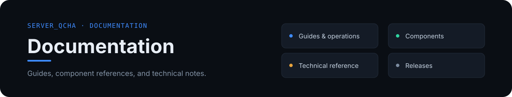

[English](README.md) · [简体中文](README.zh-CN.md) · [Project homepage](../README.md)

---

The documentation is organized by language. The English guides are translations of the corresponding Chinese guides and are maintained as matching pages. Chinese technical references that do not yet have an English counterpart are listed separately.

## English

### Getting started and operating guides

- [Getting started and deployment](en/guides/getting-started.md)
- [Web panel and standalone daemon](en/guides/web-panel.md)
- [QQ bot and game-server integration](en/guides/bot-guide.md)
- [Game plugin installation and protocol](en/guides/plugin-guide.md)
- [Configuration reference](en/guides/configuration.md)
- [FAQ and troubleshooting](en/guides/faq.md)
- [Database credential handling and live tests](en/guides/database-security.md)
- [Lightweight API query bot](en/guides/api-bot.md)

### Component guides

- [Server_Qcha.Bot](en/components/bot.md)
- [EXILED plugin](en/components/exiled-plugin.md)
- [LabAPI plugin](en/components/labapi-plugin.md)

### Releases

- [v2.0.1 release notes](en/releases/v2.0.1.md)

## 中文

- [中文文档索引与完整原文](README.zh-CN.md)
- [技术协议、实现说明与项目交接参考](zh-CN/reference/)
- [更新日志与历史发布说明](zh-CN/releases/)
