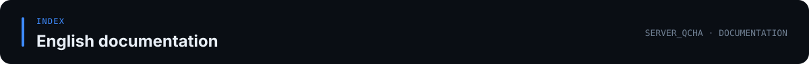

[Documentation index](../../docs/README.md) · [Project homepage](../../README.md)

# English Documentation

[English](README.md) · [简体中文](../README.zh-CN.md) · [Project homepage](../../README.md)

See the [main bilingual documentation index](../README.md) for all guides. English translations are grouped into guides, component references, and releases. Chinese technical documents without an English translation are listed in the [Chinese reference index](../README.zh-CN.md).

## Guides

- [Getting started and deployment](guides/getting-started.md)
- [Web panel and standalone daemon](guides/web-panel.md)
- [QQ bot and game-server integration](guides/bot-guide.md)
- [Plugins: EXILED and LabAPI](guides/plugin-guide.md)
- [Configuration reference](guides/configuration.md)
- [FAQ and troubleshooting](guides/faq.md)
- [Database security and live tests](guides/database-security.md)
- [Lightweight API query bot](guides/api-bot.md)

## Component guides

- [Bot](components/bot.md)
- [EXILED plugin](components/exiled-plugin.md)
- [LabAPI plugin](components/labapi-plugin.md)

## Releases

- [v2.0.1](releases/v2.0.1.md)
