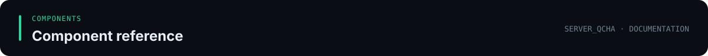

<div align="center">



</div>

[Documentation index](../../../docs/README.md) · [Project homepage](../../../README.md) · [简体中文](../../zh-CN/components/bot.md)

# Server_Qcha.Bot

[English documentation index](../README.md) · [简体中文](../../zh-CN/components/bot.md) · [Project homepage](../../../README.md)

Server_Qcha.Bot links QQ chats to SCP: Secret Laboratory servers. It receives commands from QQ and forwards supported operations to the game-server plugin over TCP. The application also hosts the web operations panel and controls the standalone LocalAdmin daemon.

## Features

- `cx`: query online-player counts across configured servers.
- `info`: query server information.
- `#<n>`: list players on server number `n`.
- `/bd <Steam64>`: bind the user's QQ account to a Steam64 ID in `playerdata.QQ_ID`.
- `/me`: query player statistics by QQ account.
- Administrator commands, restricted by `Bot:AdminUserIds` when configured:
  - `/bc <n> <message>`: broadcast a message.
  - `/round <n>`: restart a round by sending `rest`.
  - `/ban <n> <ID> <duration> <reason>`: ban by sending `kick&...`.
  - `/setadmin <n> <ID> <group>`: update a permission group through the legacy `bc&...` protocol.

## Requirements

- .NET 8 SDK to build, or the .NET 8 ASP.NET Core Runtime to run the release package.
- A QQ connection: NapCatQQ with a forward WebSocket endpoint, or the official QQ Bot platform.
- A compatible Server_Qcha plugin on each game server.
- Optional MySQL for player binding and statistics.

## Quick start

The recommended QQ framework is NapCatQQ with OneBot 11. Enable its `websocketServers` endpoint and choose a port such as `6700`; point `GoCqHttp:WsBaseUri` to `ws://127.0.0.1:6700` when running on the same host.

Copy `src/Server_Qcha.Bot/appsettings.Example.json` to the ignored `src/Server_Qcha.Bot/appsettings.Local.json`, then configure the QQ endpoint, game-server listener addresses and ports, and any optional database connection. Start the app from the `bot/` directory:

```powershell
dotnet run --project src/Server_Qcha.Bot -c Release
```

The release bundle also includes launch scripts. The web panel is available at `http://127.0.0.1:8080/` by default.

## Configuration

The default configuration is `src/Server_Qcha.Bot/appsettings.json`. Put machine-specific overrides in `appsettings.Local.json`, which is ignored by Git. Environment variables can also override configuration, for example `MySql__ConnectionString`.

- `Bot:AllowedGroupIds` limits groups the bot handles. An empty list preserves the existing behavior of listening to all groups.
- `Bot:AdminUserIds` is the explicit OneBot administrator allowlist. When populated, only listed QQ user IDs can use administrative commands. When empty, legacy group-owner/admin role checks remain, and permitted private-message users may retain the legacy fallback.
- `Bot:NotifyPrivateUserIds` controls which users may contact the bot privately. When `AdminUserIds` is configured, being on the notification list does not grant administrative access.
- `OfficialQq:AdminOpenIds` is the equivalent explicit administrator list for the official QQ bot.

Configure explicit administrator and group lists when access should be restricted. Never commit tokens, passwords, API secrets, or database connection strings. The database live test is skipped by default; see the [database security guide](../guides/database-security.md) for environment-variable setup and the handling of previously exposed credentials.

## Socket protocol

The bot sends UTF-8 commands to the game plugin, including:

```text
cx
info
list
rest
bc&<text>
kick&<id>&<reason>&<time>
bc&<id>&<group>
```

The final form is used by `/setadmin` for compatibility with the existing plugin protocol. The plugin returns a readable response that the bot uses in its QQ reply.

The panel's game-administrator feature must move hundreds of kilobytes of configuration, so it adds a length-prefixed frame on top of the same channel. **The frame body is still the same `v2|` envelope, so authentication and replay checks are identical to the legacy path:**

| Step | Command | Purpose |
|---|---|---|
| Capability probe | `game-admin-capabilities` | Still sent over the legacy text channel; a supporting plugin replies `QGA1`, otherwise the panel asks for a plugin upgrade |
| Read / write | `game-admin&{JSON}` | Written inside the `v2|` envelope and then wrapped in a `QGA1` frame to read or write in-game administrators and permission groups |

A frame is the `QGA1` ASCII magic, a 4-byte big-endian length, and a UTF-8 body, capped at 2 MiB. See the [communication protocol reference](../../zh-CN/reference/communication-protocol.md) for fields, operations, and error codes.

The command and notification channels authenticate requests with the configured shared token using HMAC, timestamps, and replay checks. Authentication does not encrypt network traffic. Use a VPN or firewall source restrictions when bot and game servers run on different machines.

## Build and test

From the `bot/` directory:

```powershell
dotnet build Server_Qcha.Bot.sln -c Release
dotnet test Server_Qcha.Bot.sln -c Release
```

See the [English deployment guide](../guides/getting-started.md), [Chinese bot guide](../../zh-CN/guides/bot-guide.md), and [configuration reference](../../zh-CN/guides/configuration.md).

## License

This component is distributed under the repository's [Apache License 2.0](../../../LICENSE).

Copyright 2025 hmyhserver.top
