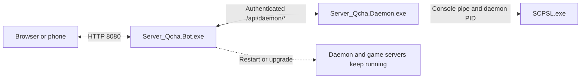

[Documentation index](../../../docs/README.md) · [Project homepage](../../../README.md) · [简体中文](../../zh-CN/guides/web-panel.md)

# Web Panel and Standalone LocalAdmin Daemon

[English documentation index](../README.md) · [简体中文](../../zh-CN/guides/web-panel.md)

Server_Qcha (Qridge) provides a web operations hub for SCP: Secret Laboratory and a standalone supervisor designed to replace the official LocalAdmin command window for managed servers.

## Why use Qridge instead of the official LocalAdmin?

The official `LocalAdmin.exe` presents one terminal window per server, requires RDP or SSH for remote operations, ties the game process to the controlling process, grants broad console access, and does not provide historical player or resource charts. Qridge provides one browser interface, multiple administrators with scoped permissions, process recovery, history, and audit records.

| Capability | Official LocalAdmin | Qridge |
|---|---|---|
| Interface | Local CLI window | Desktop and mobile web console |
| Process lifecycle | Closing the window disconnects the game | Independent daemon keeps supervised servers running when the panel restarts |
| Multi-server control | Separate window per server | Central management panel |
| Remote access | RDP/SSH | Browser from authorized devices |
| Recovery | Basic restart | Heartbeat FSM, silent-hang detection, and restart limits |
| Monitoring | No resource history | Memory, PID, uptime, threads, and player trends |
| Logs | Terminal output | Buffered web console, ANSI colors, and filtering |
| Permissions | Console users have broad control | Granular RBAC and audit history |

## Standalone daemon architecture

`Server_Qcha.Daemon.exe` supervises `SCPSL.exe`, supplies its own PID through the game's `-id` parameter, and maintains the console pipe. `Server_Qcha.Bot.exe` hosts the web panel and QQ integrations and talks to the daemon through its authenticated internal HTTP endpoint, normally `127.0.0.1:10090`. Restarting or upgrading the bot therefore does not stop game servers held by the daemon.

The daemon recreates the LocalAdmin protocol behavior needed by the game: allocates a TCP console port per server, starts the game with `-console`, `-id`, and `-heartbeat` parameters, parses output frames and ANSI codes into an in-memory ring buffer, and forwards console commands as protocol frames.

## Heartbeat and crash recovery

The heartbeat state machine waits through an initial grace period (80 seconds by default), then tracks the game's main-thread heartbeat (`0x17`). If the heartbeat exceeds its threshold (30 seconds by default), the daemon treats the server as silently hung, stops the unresponsive process, and starts it again.

To prevent an invalid config or crashing plugin from causing an endless restart loop, the daemon allows up to four consecutive restarts in a rolling 480-second window by default. When the limit is reached, automatic recovery pauses and reports the failure. An administrator can inspect logs, fix the cause, and manually restart the server in the panel.

## Web panel modules

### 1. Daemon monitor

The **Server Processes** page displays daemon online state and PID, physical working-set memory, private bytes, formatted uptime, active threads, and the number of managed/running game servers. Administrators can start the daemon, stop it after a confirmation that all supervised servers will stop, restart it gracefully, or refresh its status.

### 2. Server overview

The dashboard summarizes total players, today's peak, and managed-server count. A background sampler builds a 24-hour player trend while filtering the `Dedicated Server` placeholder. A load matrix shows each server's port, process state, online/max count, and connection latency.

### 3. LocalAdmin process management

A graphical matrix shows each local instance's PID, CPU, memory, uptime, and heartbeat recovery state. Controls include start, stop, safe restart, and force termination.

### 4. Multi-server interaction and console

Select a server to send an operation and view its response. The online-player dialog shows nickname, role, latency, and SteamID. Quick operations support kicking/banning a player and broadcasting to a server.

### 5. Mobile layout

At viewport widths of 768 px or less, the interface switches to a touch layout: the fixed sidebar becomes a hamburger menu and slide-out navigation drawer; cards reflow into one or two columns and dialogs fit within 94vw.

### 6. Multi-account RBAC

Multiple administrators can be signed in concurrently, including the same account on different devices. Module permissions include `servers.view`, `servers.control`, `accounts.manage`, and `game-admin.manage` (see section 9).

### 7. Audit log

Web/API management actions record the actor, timestamp, target server, command, result, and source client IP.

### 8. Live log-level changes

The logging level can be changed between Trace, Debug, Information, Warning, and Error while running; no process restart is required.

### 9. Game administrators

The panel manages the in-game administrators and permission groups directly, replacing manual editing of `config_remoteadmin.txt` on each game server.

- Existing administrators and permission groups are read from each server's `config_remoteadmin.txt`, edited in the panel, and written back; the game server keeps loading the same file.
- Permissions are granted item by item per administrator or group. A group carries a badge text and color that apply to every member.
- Plugin permission nodes (for example `tools.*`) support per-node allow/deny rules plus a master switch. When the switch is off, the permission check rejects the node outright, and inheritance or wildcards cannot re-grant it.
- Per-user overrides add allow/deny rules to a single administrator without changing the group, and are preserved when the group is edited.
- Permission groups can be copied to other servers, which keeps a cluster on one permission scheme.
- Changes are applied live by the plugin. Revoking an online administrator takes effect immediately, with no game-server restart.
- The entry point requires the `game-admin.manage` panel permission. The built-in administrator holds it by default; other accounts are granted it under Account Management (section 6).
- Both EXILED and LabAPI are supported. On LabAPI servers, deploy `0Harmony.dll` into the `dependencies` folder under the plugin directory (`<server-port>/dependencies/0Harmony.dll`), because the plugin relies on it to apply configuration changes.

Copyright 2025 hmyhserver.top
