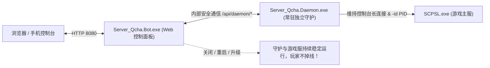

# Web 管理面板与 LocalAdmin 独立守护架构说明

**Server_Qcha (Qridge) v2.0** 的核心定位是**深度取代官方命令行黑框工具 LocalAdmin (LA)**，并为 SCP: Secret Laboratory (SCPSL) 提供现代化的 Web 运维中枢与高可用独立守护能力。

---

## 目录
- [为什么取代官方 LocalAdmin](#为什么取代官方-localadmin)
  - [官方 LocalAdmin 的局限性](#官方-localadmin-的局限性)
  - [核心能力对比](#核心能力对比)
- [v2.0 独立守护进程架构 (Standalone Daemon)](#v20-独立守护进程架构-standalone-daemon)
  - [解耦设计与防掉线原理](#解耦设计与防掉线原理)
  - [协议级底层接管与管道通信](#协议级底层接管与管道通信)
  - [心跳状态机与静默卡死自愈](#心跳状态机与静默卡死自愈)
  - [滑动时间窗口防崩溃死循环](#滑动时间窗口防崩溃死循环)
- [Web 面板核心功能模块](#web-面板核心功能模块)
  - [1. 独立守护进程监控与控制 (Daemon Monitor)](#1-独立守护进程监控与控制-daemon-monitor)
  - [2. 服务器总览 (Overview)](#2-服务器总览-overview)
  - [3. 服务器进程管理 (Local Admin)](#3-服务器进程管理-local-admin)
  - [4. 多服交互与实时控制台 (Servers)](#4-多服交互与实时控制台-servers)
  - [5. 手机专属自适应 UI (Mobile Responsive)](#5-手机专属自适应-ui-mobile-responsive)
  - [6. 细粒度多账号权限体系 (RBAC)](#6-细粒度多账号权限体系-rbac)
  - [7. 全方位操作审计日志 (Audit)](#7-全方位操作审计日志-audit)
  - [8. 动态日志级别热切换 (Logging)](#8-动态日志级别热切换-logging)

---

## 为什么取代官方 LocalAdmin

### 官方 LocalAdmin 的局限性
在传统的 SCPSL 服务器运维中，服主普遍使用官方提供的 `LocalAdmin.exe`。其主要缺陷如下：
1. **纯终端黑框界面**：每个服务器实例占用一个独立黑框，集群多开时杂乱无章且极易误关；
2. **缺乏远程运维能力**：必须通过 Windows 远程桌面 (RDP) 或 Linux SSH 登录服务器主机，无法在浏览器或手机上便捷管理；
3. **单点故障与生命周期绑定**：一旦主控程序需要更新或重启，游戏服与在线玩家全体掉线；
4. **缺少多管理员权限划分**：任何能接触控制台的人均拥有最高权限，无法分配受限角色；
5. **无历史监控与性能数据**：无法查看历史在线人数走势、峰值统计与资源消耗曲线。

### 核心能力对比

| 运维能力 | 官方 LocalAdmin (LA) | Qridge 现代化运维系统 (v2.0) |
|---|---|---|
| **交互媒介** | 本地命令行窗口 (CLI) | 现代 Web 控制台（PC 端 + 手机专属 UI） |
| **进程解耦** | 关掉窗口游戏服必掉线 | **独立守护架构**：更新或关闭面板，游戏服绝对不关、玩家不掉线 |
| **多服管理** | 一服一窗口，杂乱分散 | 单一控制台集中管理全服集群 |
| **远程管控** | 必须依赖 RDP / SSH | 任意设备浏览器即可安全访问，随时随地运维 |
| **自愈守护** | 基础崩溃退出重启 | 完备心跳状态机、静默卡死检测、重启频次限流保护 |
| **性能监控** | 无 | 物理内存占用 (MB)、专用内存、PID、存活时长与线程数实时追踪 |
| **日志与控制台** | 简单黑框打印 | Web 交互控制台、环形日志缓冲区、ANSI 颜色高亮与热过滤 |
| **权限管控** | 无，全员超级管理员 | 细粒度 RBAC 权限系统，可精确授权各模块操作 |
| **运营分析** | 无 | 24 小时在线玩家动态趋势折线图、全服在线与今日峰值 |
| **操作审计** | 无 | 全局审计日志，每次操作记录时间、人员、IP 与结果 |

---

## v2.0 独立守护进程架构 (Standalone Daemon)

### 解耦设计与防掉线原理
在 v2.0 中，系统架构进行了根本性重构：
- **`Server_Qcha.Daemon.exe`** 作为独立的 Windows/Linux 守护进程，专职担任 `SCPSL.exe` 的父进程（传递其自身的 PID 作为 `-id` 参数），并维持控制台管道长连接；
- **`Server_Qcha.Bot.exe`** 仅作为 Web 面板与社群机器人的接入端，通过内部带有密钥鉴权的轻量 HTTP 协议（`127.0.0.1:10090`）与守护进程通信；
- **核心成效**：即使服主在日常运维中**升级 Web 面板、重启机器人或者 Bot 发生意外故障，底层由 Daemon 守护的游戏服依然稳定运行，在线玩家零感知！**

### 协议级底层接管与管道通信
系统从底层完整实现了官方 LocalAdmin 与 SCPSL 服务端之间的原生通信协议：
- 守护进程为每个服务器分配专属的随机 TCP 端口作为控制台服务端；
- 使用官方标准参数拉起游戏：包含 `-console <port>`、`-id <daemon_pid>`、`-heartbeat <threshold>` 等；
- 原生解析上行数据帧（标准输出行、控制码解码、ANSI 颜色转义），维护内存环形缓冲区；
- 将面板下发的控制台指令安全封装为下行数据帧透传给游戏。

### 心跳状态机与静默卡死自愈
游戏服务器在发生死锁或无响应时，进程可能并未退出，但已无法处理玩家操作。
守护引擎内置了完备的心跳有限状态机 (FSM)：
1. **等待首个心跳阶段 (AwaitingFirstHeartbeat)**：游戏启动后给予宽限期（默认 80 秒），防止加载大地图时误判；
2. **心跳活跃期 (Active)**：实时接收游戏主线程上报的心跳信号（`0x17`）；
3. **超时判定与自愈**：一旦心跳间隔超出阈值（默认 30 秒），系统判定游戏陷入静默卡死，主动终止挂起进程并重新拉起。

### 滑动时间窗口防崩溃死循环
当服务端因配置损坏、插件崩溃等原因导致“启动即死”时，无节制的循环重启会耗尽系统 CPU 与内存。
系统引入了滑动时间窗口限流策略：
- 默认在 480 秒时间窗口内，最多允许连续重启 4 次；
- 一旦耗尽配额，系统将暂停自愈并报告异常，杜绝雪崩效应；管理员可在面板中手动重置或一键强制拉起。

---

## Web 面板核心功能模块

### 1. 独立守护进程监控与控制 (Daemon Monitor)
位于「服务器进程」页面顶部的核心看板卡片：
- **实时指标展示**：
  - **运行状态指示灯 & PID**：直观展示守护进程在线状态与系统进程 ID；
  - **物理内存占用 (工作集)**：高精度显示当前物理内存占用（MB 为单位）；
  - **专用内存 (Private Bytes)**：展示专属内存分配情况（MB 为单位）；
  - **运行时长 (Uptime)**：自动格式化显示进程存活天/时/分/秒；
  - **活动线程数**：展示进程并发线程情况；
  - **托管服务器容量**：汇总当前正在托管运行的游戏服总数与存活数；
- **一键生命周期控制**：
  - **启动守护进程**：在离线状态下一键后台拉起守护进程；
  - **停止守护进程**：弹出二次确认警告（提醒此操作将停止所有游戏服），确认后优雅关机；
  - **重启守护进程**：提供安全重启操作（优雅停机 -> 重新拉起 -> 就绪探测）；
  - **刷新状态**：支持随时手动触发指标采集。

### 2. 服务器总览 (Overview)
- **运营指标看板 (KPI)**：实时汇总全服总在线人数、今日最高峰值、纳管服务器总数；
- **24 小时动态折线图**：后台定期采样全服玩家数据，精准过滤 `Dedicated Server` 虚假占位，绘制平滑的历史在线走势曲线；
- **服务器负载矩阵**：直观展示每个服务器的端口、运行状态、在线/上限进度条与通信延迟。

### 3. 服务器进程管理 (Local Admin)
- 本地托管 SCPSL 进程的图形化控制矩阵；
- 实时展示各实例的 PID、CPU 占用、内存消耗、运行时长与心跳自愈状态；
- 支持一键执行启动、停止、安全重启与强制终止。

### 4. 多服交互与实时控制台 (Servers)
- 支持选中任意服务器下发管理指令，并在界面中实时查看返回回显；
- 在线玩家弹窗穿透：点击即可查看指定服务器的所有在线玩家（昵称、角色、延迟、SteamID）；
- 快捷操作：支持直接对特定玩家执行踢出、封禁，或向全服发送广播。

### 5. 手机专属自适应 UI (Mobile Responsive)
- 当检测到视口宽度 $\le 768\text{px}$ 时，自动激活移动端专属界面：
  - 隐藏固定侧边栏，顶栏提供触控汉堡菜单按钮；
  - 点击滑出原生 App 风格的侧滑抽屉（集成用户信息、全部功能导航与快速登出）；
  - 页面卡片自动转为 1~2 列流式排版，各类弹窗自适应为 94vw 视口宽度。

### 6. 细粒度多账号权限体系 (RBAC)
- 支持创建多个管理员账号，支持多端同时在线（电脑与手机可同时登录同一账号，互不顶号）；
- 提供模块级细粒度权限控制：
  - `servers.view`：查看服务器状态与在线情况；
  - `servers.control`：允许使用控制台与启停服务器；
  - `accounts.manage`：管理系统其他账号。

### 7. 全方位操作审计日志 (Audit)
- 自动记录所有通过 Web 界面或 API 执行的管理指令；
- 审计项包含：操作人、时间戳、目标服务器、执行指令、操作结果与来源客户端 IP 地址。

### 8. 动态日志级别热切换 (Logging)
- 支持在控制台中随时在线调整系统的运行日志输出级别（Trace/Debug/Info/Warn/Error）；
- 改动即时生效，无需重启任何进程。

---

保留所有权  liseximt@outlook.com
